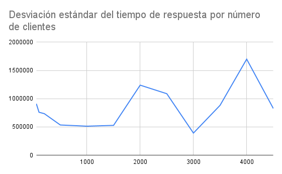

# ¡Pégale al monstruo!
## _Sistemas Distribuidos: Proyecto Alpha_

"¡Pégale al monstruo!" es un juego multijugador que utiliza sockets TCP y tópicos para comunicarse entre el servidor y los clientes. El objetivo del juego es golpear al mayor número de monstruos antes que tus oponentes. El servidor ofrece un servicio de registro para que los jugadores puedan unirse al juego y proporciona la información necesaria para jugar, como la dirección IP. 

##### ¿De qué se trata el juego "¡Pégale al monstruo!"?

- El juego consiste en golpear al mayor número de monstruos posible y convertirse en el jugador que golpea N monstruos primero para ganar el juego.

##### ¿Cómo se comunican el servidor y los clientes?

- El servidor se comunica con los clientes mediante sockets TCP y tópicos. Los tópicos se utilizan para enviar mensajes de monstruos a los clientes y para informar a los jugadores quién ha ganado el juego.

##### ¿Cómo funciona la interfaz del cliente?

- La interfaz del cliente tiene una rejilla de objetos, precisamente botones. Estos botones se utilizan para golpear al monstruo.

##### ¿Cómo se realiza el registro de los jugadores?

- El registro de los jugadores se realiza mediante sockets TCP. El servidor ofrece un servicio de registro y, como respuesta al registro, el servidor proporciona al cliente toda la información necesaria para jugar, como la dirección IP.

##### ¿Pueden los jugadores entrar y salir del juego en cualquier momento?

- Sí, los jugadores pueden entrar y salir del juego en cualquier momento sin afectar la partida actual. Además, el contexto de los jugadores, incluyendo el número de monstruos golpeados, se conserva incluso si un jugador sale y vuelve a entrar.

## Pruebas de Estresamiento 
Para realizar estas pruebas se crearon 2 clases nuevas 
##### Pruebas de tiempo de respuesta en el registro
Las pruebas del tiempo de respuesta en el registro consistieron en tomar una cantidad de clientes y ejecutar el juego 10 veces para recuperar el tiempo promedio de respuesta en el registro. 
El tiempo de respuesta en el registro TCP empieza cuando el cliente envía un mensaje de solicitud de registro con su nombre de usuario y termina cuando recibe la respuesta del servidor de que recibió correctamente los datos del cliente.
Las pruebas se hicieron inicialmente para 50, 100, 200, 500 queríamos ir aumentando el número de clientes lentamente, sin embargo, notamos que el cambio era mínimo, casi nulo. Por esto, decidimos aumentar el número de clientes y realizamos las pruebas variando los clientes aumentandolos en 500 hasta llegar al 4500.

